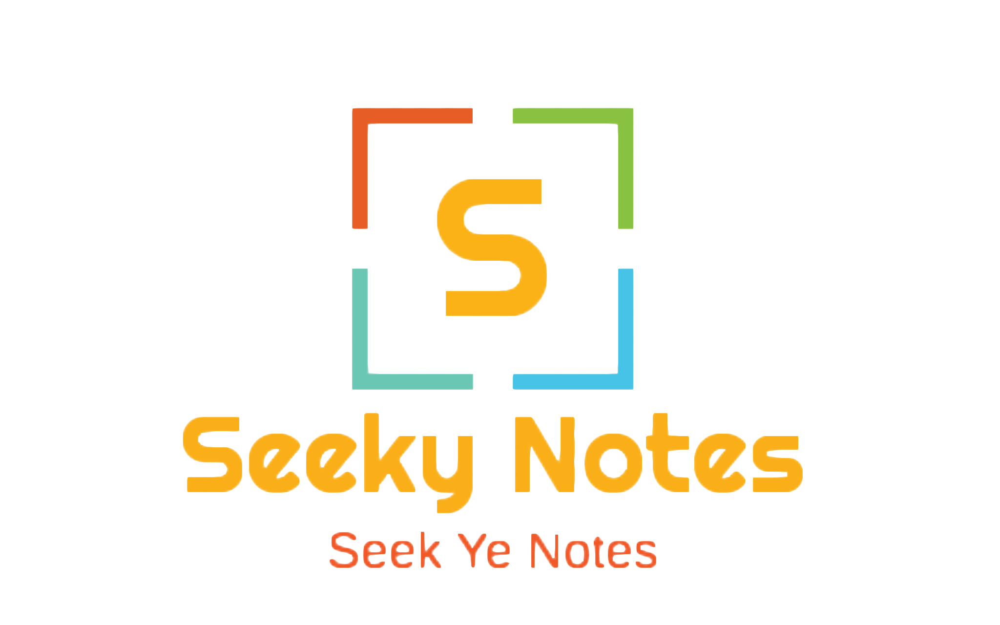
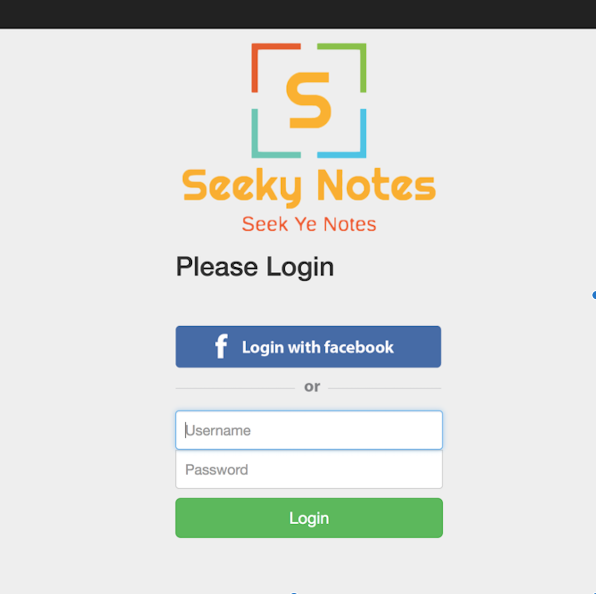
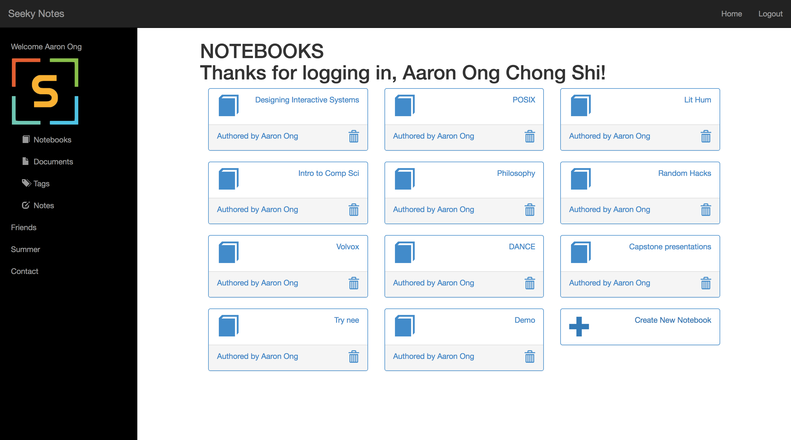
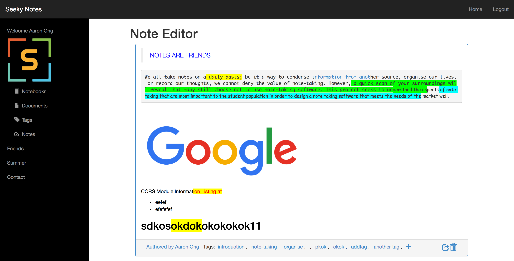
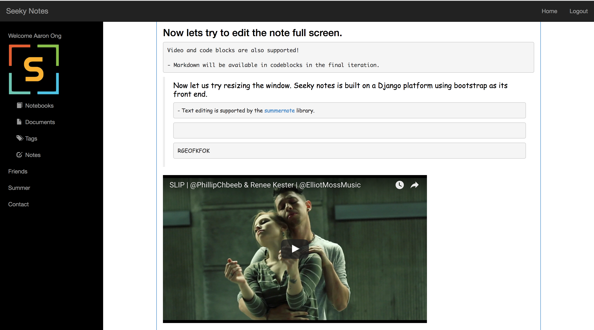
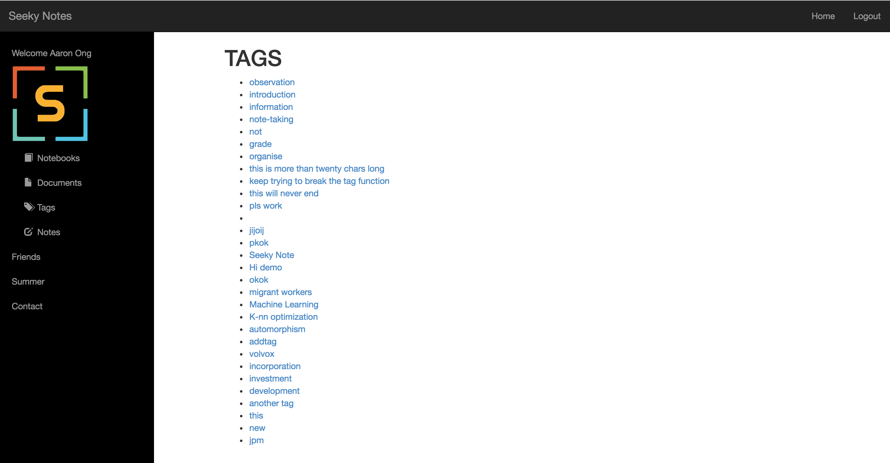
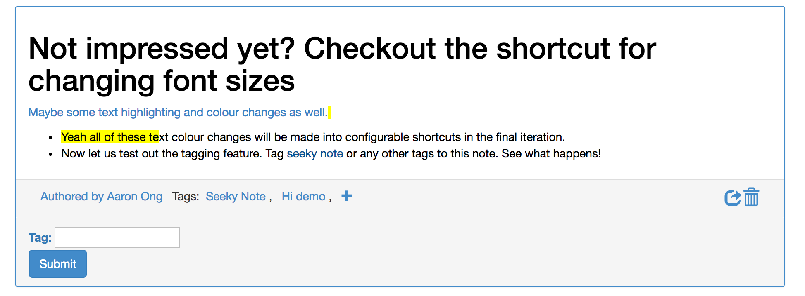
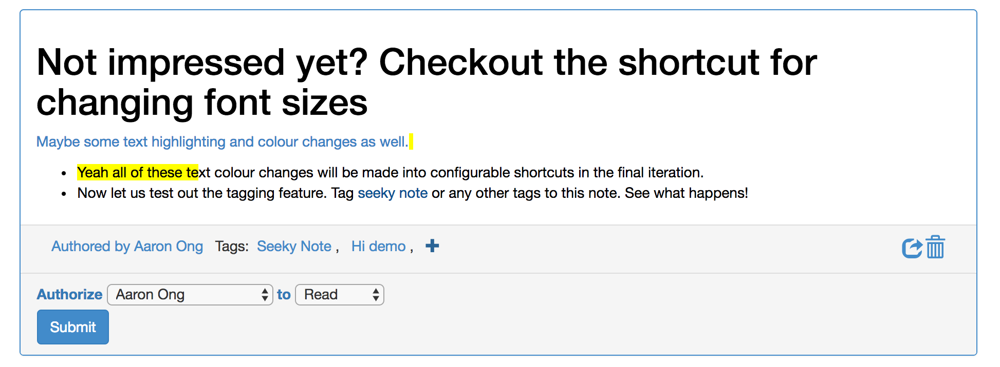

# Seeky Notes

​	

## Why did I create Seeky Notes?

When we think of note-taking software, a few big providers come to mind. Google docs, microsoft words, Evernote, OneNote. The common critique is that while most of these document editors provide an excellent set of features for users to write documents, they are not suitable platforms for note-taking. Note-taking is a very different process. With note taking, there is no need for a rich set of features. Platforms only need to offer a minimal amount of features but make them readily accessible.

#### Inconvenience of typing notes

Individuals who hand write their notes cited unintuitive shortcuts and the lack of shortcuts for key features such as colour coding and text highlighting as the largest stumbling block to the usability of note-taking applications. Popular features such as colour coding and text highlighting must be available for shortcut binding. Unfortunately, none of the note-taking software giants have responded to this pressing need yet.

#### Ineffective information retrieval across documents

Note-taking is all about information. It serves as a way to record information from temporal sources and condense important information that individuals enticipate they will require in the future.  

While users have been satisfied searching through multiple documents to find the information they need, they now find information retrieval a cumbersome process and want a way to retrieve all related snippets of information across multiple documents more effectively. Five out of seven YNC students interviewed have expressed difficulty in retrieving information from their self-written notes.

#### Poor support for collaborative note-taking

Note-taking is becoming an increasingly collaborative process. My observations revealed that users are dissatistied with the current set of collaborative features offered on note-taking platforms. Firstly, users want a way to discern the authorship of written content more clearly. As the authorship of the content affects the credibility and attention that we give to it. Secondly, users experience a lack of control over the content that they have written in collaborative documents. Parts that they have written in collaborative documents have dissapeared without a trace, or have been modified without their consent. While the onus is on team to communicate more effectively, many users view the ability to provide read and write access to different parts of a shared document a useful feature to have.

## Solution

#### Find it inconvenient to type?

- We offer customizable shortcut binding

#### Cant find the information you need?

- We perform section searches that will pull out only relevant sections of each document for you. All displayed in a single view. 

#### Can't figure out who wrote what?

- We tag each content to its author and display it in a clear manner for you to see.

#### Who changed my part?

- We provide each collaborator with the ability to set read/write and comment access to the sections that they have written.

## Dashboard

Mobile-first Bootstrap design. Easy to read both on mobile, tablets, and PC.

## Notes

Note features

- Note tagging
- Sharing of notes with multiple levels of permissions
- Change Font Colour
- Font Highlighting
- Video Embedding

